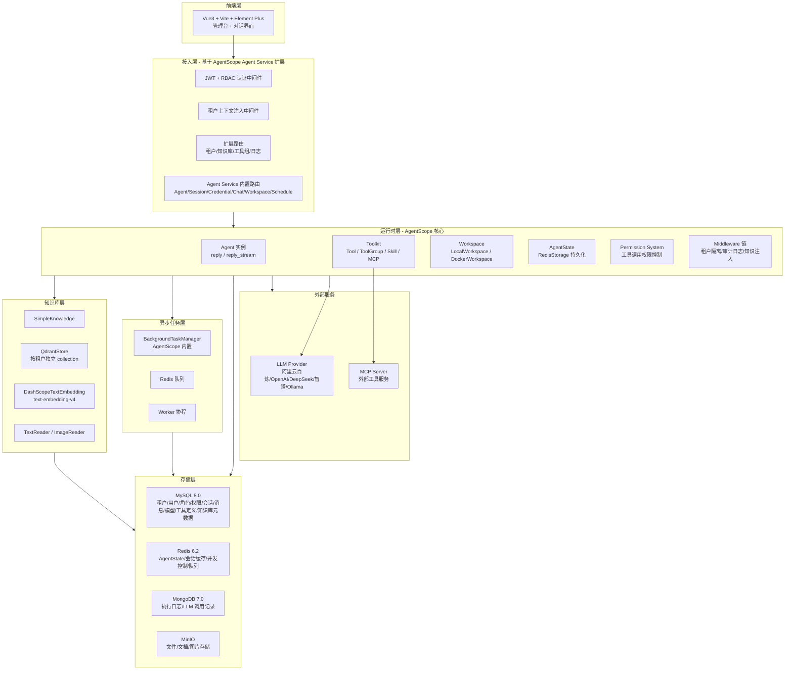
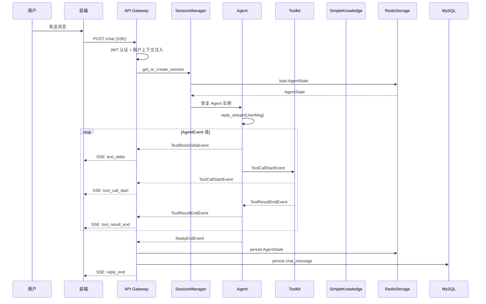
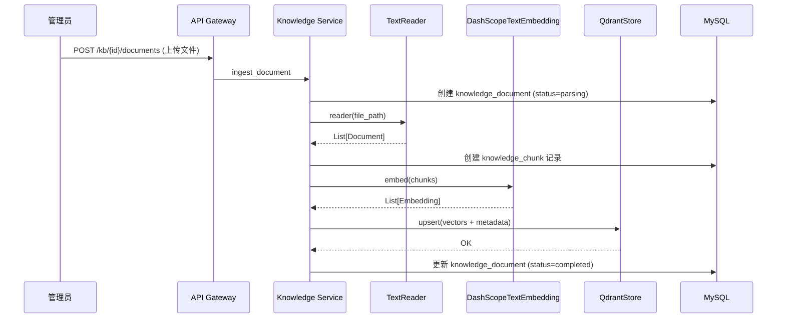
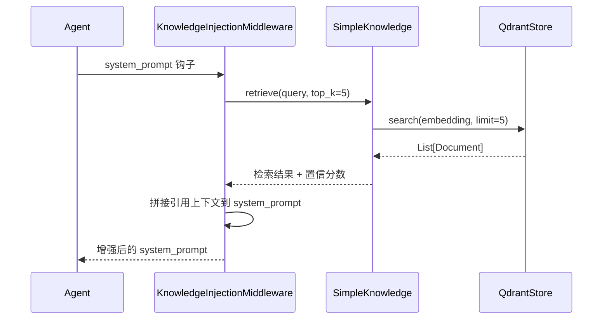

# 新项目全部功能设计方案

Feature Name: 2026-05-25-agentscope-replatform
Updated: 2026-05-25

---

## 1 概述

本方案定义一个基于 AgentScope v2 的新一代多租户智能体平台。新平台在保留现有租户管理、RBAC、对话、技能管理和日志追踪能力的基础上，将原有自研技能执行链路替换为 AgentScope 运行框架，并增加企业知识库能力。系统目标是在 8C16G 单机服务器上支撑 200+ 同时技能执行用户。

核心改造原则：**最大程度复用 AgentScope v2 内置能力，最小化自研代码**。

---

## 2 总体架构

### 2.1 架构总览



### 2.2 与 AgentScope Agent Service 的关系

新平台基于 AgentScope Agent Service 进行扩展，而非从零构建：

| 层面 | AgentScope Agent Service 提供 | 新平台扩展 |
|------|------|------|
| HTTP 服务 | create_app + FastAPI + 内置路由 | 扩展自定义路由（租户、知识库、工具组、日志） |
| 认证 | X-User-ID 占位 | 替换为 JWT + RBAC 认证依赖 |
| 会话管理 | SessionManager + buffered replay + 多订阅者 | 直接复用 |
| 持久化 | RedisStorage（Agent/Session/Credential/Message/Schedule） | 直接复用 + 同步写 MySQL chat_message |
| Workspace | LocalWorkspaceManager + DockerWorkspaceManager | 采用 LocalWorkspaceManager，按 tenant_id + agent_id 隔离 |
| 后台任务 | BackgroundTaskManager | 直接复用 |
| 聊天协议 | SSE AgentEvent 流 | 直接复用 + 前端适配 |
| 工具执行 | Toolkit + Permission + Middleware | 直接复用 + 自定义 Middleware |
| 模型管理 | Credential + ModelCard | 复用 + 扩展为租户级模型配置 |

### 2.3 数据流

#### 2.3.1 对话主流程



#### 2.3.2 知识库入库流程



#### 2.3.3 知识检索增强流程



---

## 3 组件详细设计

### 3.1 API Gateway（基于 AgentScope Agent Service 扩展）

#### 3.1.1 服务启动

```python
from agentscope.app import create_app, RedisStorage
from agentscope.app._manager import LocalWorkspaceManager
from platform_ext.routers import tenant, knowledge, tool_group, execution_log
from platform_ext.auth import JWTAuthDependency

storage = RedisStorage(host="localhost", port=6379)
workspace_manager = LocalWorkspaceManager(
    basedir="/data/workspaces",
    ttl=3600.0,
)

app = create_app(
    storage=storage,
    workspace_manager=workspace_manager,
    extra_middlewares=[TenantContextMiddleware],
)

# 替换认证依赖
from agentscope.app._deps import get_current_user_id as default_dep
app.dependency_overrides[default_dep] = JWTAuthDependency()

# 注册扩展路由
app.include_router(tenant.router, prefix="/api/v2")
app.include_router(knowledge.router, prefix="/api/v2")
app.include_router(tool_group.router, prefix="/api/v2")
app.include_router(execution_log.router, prefix="/api/v2")

# 挂载前端静态资源
app.mount("/assets", StaticFiles(directory="web/dist/assets"))
```

#### 3.1.2 扩展路由清单

| 路由前缀 | 模块 | 说明 |
|---------|------|------|
| `/api/v2/tenants` | 租户管理 | CRUD + 用户管理 |
| `/api/v2/kb` | 知识库管理 | 知识库 CRUD + 文档管理 + 切片查询 |
| `/api/v2/kb/{id}/documents` | 文档管理 | 上传/删除/重建索引 |
| `/api/v2/tool-groups` | 工具组管理 | 工具组 CRUD + 工具注册 |
| `/api/v2/execution-logs` | 执行日志 | 按会话/租户/时间查询 |
| `/api/v2/observability/metrics` | 监控指标 | Prometheus 格式输出 |

#### 3.1.3 Agent Service 内置路由（直接复用）

| 路由前缀 | 说明 |
|---------|------|
| `POST /chat` | SSE 流式对话 |
| `GET/POST/PATCH/DELETE /agent` | 智能体 CRUD |
| `GET/POST/PATCH/DELETE /sessions` | 会话管理 |
| `GET /sessions/{id}/messages` | 消息历史 |
| `GET/POST/PATCH/DELETE /credential` | 凭证管理 |
| `GET /credential/schemas` | 凭证 Schema |
| `GET /model?provider=<name>` | 模型列表 |
| `GET/POST/PATCH/DELETE /schedule` | 定时任务 |
| `GET /background-tasks` | 后台任务 |
| `GET/POST /workspace/mcp` | MCP 管理 |
| `GET/POST /workspace/skill` | Skill 管理 |

### 3.2 Agent Runtime Service

#### 3.2.1 Agent 构建器

```python
from agentscope import Agent
from agentscope.agent import ContextConfig, ReActConfig
from agentscope.tool import Toolkit, ToolGroup
from agentscope.state import AgentState
from agentscope.model import DashScopeChatModel
from agentscope.credential import DashScopeCredential

class PlatformAgentBuilder:
    """根据平台智能体定义构建 AgentScope Agent 实例"""

    async def build(
        self,
        agent_def: AgentDefinition,
        credential: CredentialRecord,
        toolkit: Toolkit,
        state: AgentState | None = None,
        knowledge: SimpleKnowledge | None = None,
    ) -> Agent:
        model = self._build_model(agent_def, credential)
        context_config = ContextConfig(
            trigger_ratio=0.7,
            reserve_ratio=0.2,
            tool_result_limit=2000,
        )
        react_config = ReActConfig(
            max_iters=10,
        )
        agent = Agent(
            name=agent_def.name,
            system_prompt=agent_def.sys_prompt,
            model=model,
            toolkit=toolkit,
            state=state or AgentState(),
            context_config=context_config,
            react_config=react_config,
            offloader=workspace,
            middlewares=self._build_middlewares(agent_def),
        )
        return agent

    def _build_middlewares(self, agent_def):
        return [
            TenantIsolationMiddleware(agent_def.tenant_id),
            AuditLoggingMiddleware(),
            KnowledgeInjectionMiddleware(agent_def.kb_ids),
        ]
```

#### 3.2.2 Toolkit 组装器

```python
from agentscope.tool import Toolkit, ToolGroup, FunctionTool
from agentscope.mcp import MCPClient, HttpMCPConfig

class PlatformToolkitAssembler:
    """根据平台工具组配置组装 AgentScope Toolkit"""

    async def assemble(
        self,
        tool_groups: list[ToolGroupDefinition],
        skills: list[str],
        mcp_configs: list[MCPConfig],
    ) -> Toolkit:
        basic_tools = []
        tool_group_defs = []

        for tg in tool_groups:
            group_tools = []
            for tool_def in tg.tools:
                if tool_def.runtime_type == "function":
                    group_tools.append(FunctionTool(
                        func=tool_def.entrypoint,
                        name=tool_def.tool_code,
                        description=tool_def.tool_name,
                    ))
                elif tool_def.runtime_type == "external":
                    group_tools.append(self._build_external_tool(tool_def))

            tool_group_defs.append(ToolGroup(
                name=tg.group_code,
                description=tg.description,
                tools=group_tools,
            ))

        mcps = []
        for mcp_cfg in mcp_configs:
            mcps.append(MCPClient(
                name=mcp_cfg.name,
                is_stateful=mcp_cfg.is_stateful,
                mcp_config=HttpMCPConfig(url=mcp_cfg.url),
            ))

        return Toolkit(
            tools=basic_tools,
            tool_groups=tool_group_defs,
            mcps=mcps,
            skills_or_loaders=skills,
        )
```

### 3.3 Knowledge Base Service

#### 3.3.1 知识库核心实现

```python
from agentscope.rag import SimpleKnowledge, QdrantStore, TextReader, ImageReader
from agentscope.embedding import DashScopeTextEmbedding, DashScopeMultiModalEmbedding

class PlatformKnowledgeService:
    """企业知识库服务，封装 AgentScope RAG 能力"""

    async def create_knowledge(self, kb: KnowledgeBase) -> SimpleKnowledge:
        knowledge = SimpleKnowledge(
            embedding_model=DashScopeTextEmbedding(
                api_key=kb.embedding_api_key,
                model_name=kb.embedding_model or "text-embedding-v4",
                dimensions=kb.dimensions or 1024,
            ),
            embedding_store=QdrantStore(
                location=kb.qdrant_url or ":memory:",
                collection_name=f"tenant_{kb.tenant_id}_kb_{kb.id}",
                dimensions=kb.dimensions or 1024,
            ),
        )
        return knowledge

    async def ingest_document(self, kb_id: str, file_path: str, content_type: str):
        knowledge = await self._get_or_create(kb_id)
        if content_type.startswith("image/"):
            reader = ImageReader()
        else:
            reader = TextReader(chunk_size=512, split_by="paragraph")
        docs = await reader(text=file_path)
        await knowledge.add_documents(docs)
        # 同步写入 MySQL knowledge_chunk 记录

    async def retrieve(self, kb_id: str, query: str, top_k: int = 5, score_threshold: float = 0.5):
        knowledge = await self._get_or_create(kb_id)
        results = await knowledge.retrieve(query=query, limit=top_k, score_threshold=score_threshold)
        return results

    async def rebuild_index(self, kb_id: str):
        # 删除 Qdrant collection，重新入库所有文档
        pass
```

#### 3.3.2 RAG 集成模式

**模式一：通用模式（自动注入）**

```python
agent = Agent(
    name="Friday",
    system_prompt="你是企业智能助手。",
    model=model,
    knowledge=knowledge,  # AgentScope 自动在回复前注入检索上下文
)
```

**模式二：智能体自主模式（工具调用）**

```python
toolkit = Toolkit()
toolkit.register_tool_function(
    knowledge.retrieve_knowledge,
    func_description="用于检索与给定查询相关的企业文档。当需要查找企业内部信息时使用此工具。",
)

agent = Agent(
    name="Friday",
    system_prompt="你是企业智能助手。",
    model=model,
    toolkit=toolkit,
)
```

### 3.4 Middleware 设计

#### 3.4.1 TenantIsolationMiddleware

```python
from agentscope.middleware import MiddlewareBase

class TenantIsolationMiddleware(MiddlewareBase):
    """在 Agent 生命周期关键节点注入租户隔离逻辑"""

    def __init__(self, tenant_id: str):
        self.tenant_id = tenant_id

    async def on_reply(self, agent, inputs, next_handler):
        # 注入 tenant_id 到 trace context
        set_trace_tenant(self.tenant_id)
        return await next_handler(agent, inputs)

    async def on_acting(self, agent, tool_calls, next_handler):
        # 校验工具调用的资源归属
        for tc in tool_calls:
            self._check_tool_access(tc)
        return await next_handler(agent, tool_calls)
```

#### 3.4.2 AuditLoggingMiddleware

```python
class AuditLoggingMiddleware(MiddlewareBase):
    """记录 LLM 调用和工具调用的审计日志"""

    async def on_model_call(self, agent, messages, next_handler):
        start = time.monotonic()
        result = await next_handler(agent, messages)
        duration_ms = (time.monotonic() - start) * 1000
        await self._log_model_call(agent, duration_ms, result)
        return result
```

#### 3.4.3 KnowledgeInjectionMiddleware

```python
class KnowledgeInjectionMiddleware(MiddlewareBase):
    """在 system_prompt 钩子中注入知识检索结果"""

    def __init__(self, kb_ids: list[str]):
        self.kb_ids = kb_ids

    async def on_system_prompt(self, agent, system_prompt, next_handler):
        # 从最近用户消息中提取查询意图
        query = self._extract_query(agent)
        if query and self.kb_ids:
            results = await knowledge_service.retrieve(self.kb_ids[0], query)
            if results:
                context = self._format_context(results)
                system_prompt = f"{system_prompt}\n\n## 参考知识\n{context}"
        return await next_handler(agent, system_prompt)
```

### 3.5 认证与权限

#### 3.5.1 JWT 认证

```python
from fastapi import Header, HTTPException, status

async def get_current_user_id(authorization: str = Header(...)) -> str:
    try:
        payload = decode_jwt(authorization.removeprefix("Bearer "))
        return payload["sub"]
    except InvalidTokenError:
        raise HTTPException(status_code=status.HTTP_401_UNAUTHORIZED)

# 替换 Agent Service 默认依赖
app.dependency_overrides[default_dep] = get_current_user_id
```

#### 3.5.2 RBAC + Permission System 映射

```
平台 RBAC 权限                AgentScope Permission 决策
├── skill:execute             ├── ALLOW（角色有权限）
├── skill:execute:confirm     ├── ASK（需要用户确认）
├── knowledge:read            ├── ALLOW
├── knowledge:write           ├── ASK
└── admin:all                 └── ALLOW + BYPASS
```

### 3.6 Workspace 管理

```python
from agentscope.workspace import LocalWorkspace
from agentscope.app._manager import LocalWorkspaceManager

class TenantAwareWorkspaceManager(LocalWorkspaceManager):
    """按 tenant_id + agent_id 隔离的 Workspace 管理器"""

    def _workspace_dir(self, tenant_id: str, agent_id: str) -> str:
        return os.path.join(self._basedir, tenant_id, agent_id)

    async def create_workspace(self, user_id, agent_id, session_id):
        tenant_id = get_current_tenant_id()
        workdir = self._workspace_dir(tenant_id, agent_id)
        workspace = LocalWorkspace(
            workdir=workdir,
            skill_paths=self._skill_paths,
        )
        await workspace.initialize()
        return workspace
```

---

## 4 数据模型

### 4.1 MySQL 表设计

#### 4.1.1 保留现有表（8 张）

| 表名 | 主键 | 核心字段 |
|------|------|---------|
| `sys_tenant` | id (varchar 36) | name, status, skills_dir, work_dir, max_skills, max_concurrent_executions, metadata |
| `sys_user` | id (varchar 36) | tenant_id, username, password_hash, roles, permissions, is_active |
| `sys_role` | id (varchar 36) | tenant_id, role_name, description, status |
| `sys_permission` | id (varchar 36) | code, name, resource_type, action |
| `sys_user_role` | id | user_id, role_id |
| `sys_role_permission` | id | role_id, permission_id |
| `chat_session` | id (varchar 36) | tenant_id, user_id, title, active_skill_names, metadata, del_flag |
| `chat_message` | id (varchar 36) | session_id, role, content, skill_name, total_tokens, model_name, metadata |

#### 4.1.2 保留并升级现有表（2 张）

**chat_model** 增加字段：

| 新增字段 | 类型 | 说明 |
|---------|------|------|
| `credential_type` | varchar(50) | 对应 AgentScope Credential 类型 |
| `context_size` | int | 模型上下文窗口大小 |
| `output_size` | int | 最大输出 token |
| `input_types` | json | 接受的 MIME 类型列表 |
| `output_types` | json | 输出的 MIME 类型列表 |

**chat_provider** 增加字段：

| 新增字段 | 类型 | 说明 |
|---------|------|------|
| `credential_schema` | json | AgentScope Credential JSON Schema |

#### 4.1.3 新增表（7 张）

**1. agent_definition - 智能体定义**

| 字段 | 类型 | 约束 | 说明 |
|------|------|------|------|
| `id` | varchar(36) | PK | 主键 |
| `tenant_id` | varchar(36) | NOT NULL, INDEX | 租户 ID |
| `name` | varchar(100) | NOT NULL | 智能体名称 |
| `agent_type` | varchar(20) | NOT NULL DEFAULT 'react' | 类型: react/conversational/workflow |
| `sys_prompt` | text | NOT NULL | 系统提示词 |
| `model_id` | varchar(36) | NULL | 绑定模型 ID |
| `credential_id` | varchar(36) | NULL | 绑定凭证 ID |
| `tool_group_config` | json | NULL | 工具组绑定配置 [{"group_code": "doc-tools", "active": true}] |
| `kb_binding_config` | json | NULL | 知识库绑定配置 [{"kb_id": "xxx", "mode": "auto"}] |
| `context_config` | json | NULL | 上下文配置 {"trigger_ratio": 0.7, "reserve_ratio": 0.2} |
| `react_config` | json | NULL | ReAct 配置 {"max_iters": 10} |
| `memory_policy` | varchar(20) | NOT NULL DEFAULT 'session' | 内存策略: session/persistent |
| `workspace_type` | varchar(20) | NOT NULL DEFAULT 'local' | 工作空间类型: local/docker |
| `status` | char(1) | NOT NULL DEFAULT '0' | 状态: 0=正常, 1=停用 |
| `created_at` | datetime | NOT NULL DEFAULT CURRENT_TIMESTAMP | |
| `updated_at` | datetime | NOT NULL DEFAULT CURRENT_TIMESTAMP ON UPDATE CURRENT_TIMESTAMP | |
| `del_flag` | char(1) | NOT NULL DEFAULT '0' | |

**2. tool_group_definition - 工具组定义**

| 字段 | 类型 | 约束 | 说明 |
|------|------|------|------|
| `id` | varchar(36) | PK | 主键 |
| `tenant_id` | varchar(36) | NOT NULL, INDEX | 租户 ID |
| `group_code` | varchar(50) | NOT NULL | 组编码 |
| `group_name` | varchar(100) | NOT NULL | 组名称 |
| `description` | varchar(500) | NULL | 描述 |
| `instructions` | text | NULL | 激活时返回给 Agent 的指令 |
| `is_active` | tinyint(1) | NOT NULL DEFAULT 1 | 默认是否激活 |
| `status` | char(1) | NOT NULL DEFAULT '0' | |
| `created_at` | datetime | NOT NULL | |
| `updated_at` | datetime | NOT NULL | |
| `del_flag` | char(1) | NOT NULL DEFAULT '0' | |

**3. tool_definition - 工具定义**

| 字段 | 类型 | 约束 | 说明 |
|------|------|------|------|
| `id` | varchar(36) | PK | 主键 |
| `tenant_id` | varchar(36) | NOT NULL, INDEX | 租户 ID |
| `group_id` | varchar(36) | NULL, INDEX | 所属工具组 ID |
| `tool_code` | varchar(100) | NOT NULL | 工具编码 |
| `tool_name` | varchar(100) | NOT NULL | 工具名称 |
| `description` | varchar(500) | NULL | 工具描述 |
| `runtime_type` | varchar(20) | NOT NULL | 运行类型: function/external/mcp/skill |
| `entrypoint` | text | NULL | 入口: Python 函数路径 / MCP URL / Skill 路径 |
| `schema_json` | json | NULL | JSON Schema |
| `is_concurrency_safe` | tinyint(1) | NOT NULL DEFAULT 1 | |
| `is_read_only` | tinyint(1) | NOT NULL DEFAULT 0 | |
| `permission_behavior` | varchar(10) | NOT NULL DEFAULT 'ask' | allow/ask/deny |
| `status` | char(1) | NOT NULL DEFAULT '0' | |
| `created_at` | datetime | NOT NULL | |
| `updated_at` | datetime | NOT NULL | |
| `del_flag` | char(1) | NOT NULL DEFAULT '0' | |

**4. knowledge_base - 知识库**

| 字段 | 类型 | 约束 | 说明 |
|------|------|------|------|
| `id` | varchar(36) | PK | 主键 |
| `tenant_id` | varchar(36) | NOT NULL, INDEX | 租户 ID |
| `name` | varchar(100) | NOT NULL | 知识库名称 |
| `description` | varchar(500) | NULL | 描述 |
| `embedding_model` | varchar(100) | NOT NULL DEFAULT 'text-embedding-v4' | Embedding 模型 |
| `embedding_api_key` | varchar(255) | NULL | Embedding API Key |
| `dimensions` | int | NOT NULL DEFAULT 1024 | 向量维度 |
| `qdrant_url` | varchar(255) | NULL | Qdrant 地址 |
| `qdrant_collection` | varchar(100) | NULL | Qdrant Collection 名称 |
| `retrieval_strategy` | varchar(20) | NOT NULL DEFAULT 'auto' | auto/agent_controlled |
| `chunk_size` | int | NOT NULL DEFAULT 512 | 切片大小 |
| `top_k` | int | NOT NULL DEFAULT 5 | 默认检索数量 |
| `score_threshold` | float | NOT NULL DEFAULT 0.5 | 置信阈值 |
| `visibility` | varchar(20) | NOT NULL DEFAULT 'tenant' | private/tenant/public |
| `allowed_roles` | json | NULL | 允许访问的角色 |
| `status` | char(1) | NOT NULL DEFAULT '0' | |
| `created_at` | datetime | NOT NULL | |
| `updated_at` | datetime | NOT NULL | |
| `del_flag` | char(1) | NOT NULL DEFAULT '0' | |

**5. knowledge_document - 知识文档**

| 字段 | 类型 | 约束 | 说明 |
|------|------|------|------|
| `id` | varchar(36) | PK | 主键 |
| `kb_id` | varchar(36) | NOT NULL, INDEX | 知识库 ID |
| `tenant_id` | varchar(36) | NOT NULL, INDEX | 租户 ID |
| `filename` | varchar(255) | NOT NULL | 文件名 |
| `content_type` | varchar(100) | NULL | MIME 类型 |
| `storage_path` | varchar(500) | NOT NULL | MinIO 存储路径 |
| `file_size` | bigint | NULL | 文件大小 (bytes) |
| `parse_status` | varchar(20) | NOT NULL DEFAULT 'pending' | pending/parsing/chunking/embedding/completed/failed |
| `chunk_count` | int | NOT NULL DEFAULT 0 | 切片数量 |
| `version` | int | NOT NULL DEFAULT 1 | 版本号 |
| `error_message` | text | NULL | 失败原因 |
| `created_at` | datetime | NOT NULL | |
| `updated_at` | datetime | NOT NULL | |

**6. knowledge_chunk - 知识切片**

| 字段 | 类型 | 约束 | 说明 |
|------|------|------|------|
| `id` | varchar(36) | PK | 主键 |
| `document_id` | varchar(36) | NOT NULL, INDEX | 文档 ID |
| `kb_id` | varchar(36) | NOT NULL, INDEX | 知识库 ID |
| `tenant_id` | varchar(36) | NOT NULL, INDEX | 租户 ID |
| `chunk_index` | int | NOT NULL | 切片序号 |
| `content` | text | NOT NULL | 切片内容 |
| `metadata_json` | json | NULL | 元数据 (source/page/position) |
| `vector_id` | varchar(100) | NULL | Qdrant 向量 ID |
| `created_at` | datetime | NOT NULL | |

**7. execution_trace - 执行追踪**

| 字段 | 类型 | 约束 | 说明 |
|------|------|------|------|
| `id` | varchar(36) | PK | 主键 |
| `tenant_id` | varchar(36) | NOT NULL, INDEX | 租户 ID |
| `session_id` | varchar(36) | NOT NULL, INDEX | 会话 ID |
| `agent_id` | varchar(36) | NULL, INDEX | 智能体 ID |
| `reply_id` | varchar(36) | NULL | AgentScope reply_id |
| `stage` | varchar(30) | NOT NULL | reply/reasoning/acting/tool_call/knowledge_retrieval |
| `event_type` | varchar(50) | NOT NULL | AgentScope 事件类型 |
| `tool_name` | varchar(100) | NULL | 工具名称 |
| `status` | varchar(20) | NOT NULL | started/completed/failed |
| `duration_ms` | int | NULL | 耗时 (ms) |
| `input_tokens` | int | NULL | LLM 输入 token |
| `output_tokens` | int | NULL | LLM 输出 token |
| `payload_json` | json | NULL | 事件负载 |
| `created_at` | datetime | NOT NULL, INDEX | |

### 4.2 Redis Key 设计

| Key 模式 | 类型 | TTL | 用途 |
|---------|------|-----|------|
| `agentscope:session:{session_id}:state` | String (JSON) | 24h | AgentState 持久化 |
| `agentscope:tenant:{tenant_id}:concurrency` | ZSET | holder_ttl | 租户分布式并发信号量 |
| `agentscope:kb:{kb_id}:knowledge` | String (JSON) | 10min | SimpleKnowledge 实例缓存 |
| `agentscope:queue:task` | LIST | - | 异步任务队列 |
| `agentscope:rate:{tenant_id}` | String (counter) | 60s | 租户限流计数器 |
| `agentscope:sse:{session_id}` | Pub/Sub | - | SSE 事件广播 |

### 4.3 MongoDB 集合

| 集合 | 用途 |
|------|------|
| `session_execution_logs` | 会话级执行日志（层级结构） |
| `llm_call_logs` | LLM 调用记录（token 消耗、响应时间） |

### 4.4 Qdrant Collection 设计

每个租户的每个知识库使用独立 collection：

| 命名规则 | dimensions | 内容 |
|---------|-----------|------|
| `tenant_{tenant_id}_kb_{kb_id}` | 1024 | 向量 + payload (chunk_id, content, source, page) |

---

## 5 技能迁移映射方案

### 5.1 迁移映射表

| 现有技能 | AgentScope 映射类型 | 映射细节 |
|---------|-----|---------|
| official-doc-writer | ToolGroup (doc-tools) | 拆为 generate_document + preview_document + download_document 三个 FunctionTool |
| document-summary | FunctionTool | 封装摘要逻辑为单函数 |
| image-generator | ExternalExecutionTool | 通过 BackgroundTaskManager 异步执行 |
| audio-transcription | ExternalExecutionTool | 通过 BackgroundTaskManager 异步执行 |
| email-helper | FunctionTool | 封装邮件逻辑为单函数 |

### 5.2 official-doc-writer 迁移示例

```python
from agentscope.tool import FunctionTool, ToolGroup

async def generate_official_document(
    doc_type: str,
    title: str,
    issuer: str,
    recipient: str,
    body_points: list[str],
) -> ToolResponse:
    """生成党政机关公文预览"""
    # 复用现有 document_generator.py
    preview = await generate_preview(doc_type, title, issuer, recipient, body_points)
    return ToolResponse(content=[TextBlock(type="text", text=preview)])

async def download_official_document(
    doc_type: str,
    title: str,
    issuer: str,
    recipient: str,
    body_points: list[str],
    date: str,
) -> ToolResponse:
    """生成并下载 Word 格式公文"""
    file_url = await generate_docx(doc_type, title, issuer, recipient, body_points, date)
    return ToolResponse(content=[TextBlock(type="text", text=f"[下载链接]({file_url})")])

doc_tool_group = ToolGroup(
    name="doc-tools",
    description="党政机关公文生成工具组",
    instructions="使用 generate_official_document 预览公文，确认后使用 download_official_document 下载 Word 文件。",
    tools=[
        FunctionTool(generate_official_document),
        FunctionTool(download_official_document),
    ],
)
```

---

## 6 前端改造方案

### 6.1 页面清单

| 页面 | 状态 | 说明 |
|------|------|------|
| Login | 保留 | 调整登录接口到新 API |
| Dashboard | 保留 | 统计数据适配新表 |
| TenantManagement | 保留 | 无变更 |
| UserManagement | 保留 | 无变更 |
| RoleManagement | 保留 | 无变更 |
| ModelManagement | 保留+升级 | 增加 Credential 管理和 ModelCard 展示 |
| SkillManagement | 升级 | 改为 ToolGroupManagement，支持工具组/工具/MCP/Skill 管理 |
| AgentChat | 保留+升级 | 适配 AgentEvent SSE 流，支持 ThinkingBlock/ToolCall 事件展示 |
| KnowledgeBase | 新增 | 知识库列表、文档管理、切片查看、统计信息 |
| ImageGeneration | 保留 | 适配 ExternalExecutionTool 模式 |
| AudioTranscribe | 保留 | 适配 ExternalExecutionTool 模式 |
| ImageTemplate | 保留 | 无变更 |
| Feedback | 保留 | 无变更 |
| DictManagement | 保留 | 无变更 |

### 6.2 AgentChat SSE 适配

现有前端接收自定义 SSE 事件，需适配 AgentScope AgentEvent：

```
AgentScope AgentEvent          前端 SSE 事件映射
├── ReplyStartEvent        → event: reply_start
├── TextBlockDeltaEvent    → event: text_delta      (对应现有 token 事件)
├── ThinkingBlockDeltaEvent → event: thinking_delta  (对应现有 thinking 事件)
├── ToolCallStartEvent     → event: tool_call_start  (新增)
├── ToolCallDeltaEvent     → event: tool_call_delta  (新增)
├── ToolCallEndEvent       → event: tool_call_end    (新增)
├── ToolResultStartEvent   → event: tool_result_start (新增)
├── ToolResultTextDeltaEvent → event: tool_result_delta (新增)
├── ToolResultEndEvent     → event: tool_result_end   (新增)
├── ModelCallStartEvent    → event: model_call_start  (新增)
├── ModelCallEndEvent      → event: model_call_end    (新增)
└── ReplyEndEvent          → event: reply_end
```

前端使用 AgentScope 官方 TypeScript SDK 重建消息：

```typescript
import { AssistantMsg, ReplyStartEvent } from "@agentscope-ai/agentscope/message";

let msg: AssistantMsg | null = null;

for await (const event of stream) {
    if (event.type === "REPLY_START") {
        msg = new AssistantMsg({ name: event.name, content: [], id: event.reply_id });
    } else {
        msg?.appendEvent(event);
    }
}
```

---

## 7 8C16G 容量设计

### 7.1 容量目标

- 同时 skill 执行用户数 > 200
- 管理后台与聊天接口共用单机入口
- 优先保障轻量问答与轻量工具调用成功率

### 7.2 进程与资源规划

```
8C16G 服务器资源分配
├── FastAPI + AgentScope Agent Service (4 workers)  → 3G
├── Agent Runtime (Agent 实例池, 异步执行)          → 6G
├── Redis (AgentState + 缓存 + 队列 + 信号量)      → 1.5G
├── MySQL (连接池 50 + 30 overflow)                 → 1.5G
├── Qdrant (向量索引, 内存模式或独立进程)            → 2G
├── MongoDB (执行日志)                               → 0.5G
├── MinIO (对象存储)                                 → 0.5G
└── 系统 + Worker 峰值缓冲                           → 1G
```

### 7.3 并发模型

| 维度 | 配置 | 依据 |
|------|------|------|
| API Worker | 4 | uvicorn --workers 4 |
| MySQL 连接池 | 50 + 30 overflow | 每连接约 5MB |
| Redis 连接池 | 100 | aioredis 默认 |
| LLM 并发信号量 | 200 | 每进程 LLM_GLOBAL_MAX_CONCURRENCY |
| AgentState 缓存 | LRU + TTL 1h | WorkspaceManager 默认 |
| SSE 长连接 | 2000+ | 每连接约 10KB |
| Qdrant 检索 | 200 QPS | 向量检索低 CPU 开销 |

### 7.4 AgentState 内存优化

关键设计：Agent 实例不常驻内存，按需构建和销毁。

```
请求流程:
1. 请求到达 → 从 RedisStorage 加载 AgentState
2. 构建 Agent 实例（注入 State）
3. 执行 reply_stream
4. 持久化 AgentState 到 RedisStorage
5. 释放 Agent 实例

内存占用估算:
- 单个 AgentState: ~50KB（10 轮对话上下文）
- 200 并发: 200 × 50KB = 10MB
- 加上 Agent 实例和 Toolkit: 200 × 2MB = 400MB
```

### 7.5 限流与降级策略

**三级限流**：

| 级别 | 触发条件 | 策略 |
|------|---------|------|
| 租户级 | 单租户并发 > max_concurrent_executions | 排队等待，超时返回 429 |
| 全局级 | 总并发 > 300 | 新请求排队，优先保障已执行请求 |
| LLM 级 | LLM 调用并发 > 200 | 信号量等待，超时降级为缓存回复 |

**降级策略**：

1. 关闭大文件即时解析，改为异步
2. 降低图片生成和音频转写并发额度
3. 限制知识检索 top_k 和上下文拼接长度
4. 低优先级租户排队

---

## 8 迁移计划

### Phase 1: 核心执行链路迁移

- 部署 AgentScope Agent Service 基础服务
- 实现 PlatformAgentBuilder 和 PlatformToolkitAssembler
- 迁移 official-doc-writer 和 document-summary 为 FunctionTool
- 适配前端 SSE 到 AgentEvent 流
- 实现核心对话、工具调用和日志链路
- 替换认证为 JWT + RBAC

### Phase 2: 知识库与异步能力

- 部署 Qdrant
- 实现 PlatformKnowledgeService
- 迁移 image-generator 和 audio-transcription 为 ExternalExecutionTool
- 接入 MCP 工具协议
- 接入 Skill 指令集
- 实现长期记忆（跨会话 AgentState 恢复）

### Phase 3: 容量与可观测性

- 8C16G 容量压测（200+ 并发）
- 实施限流、排队和监控告警
- Prometheus 指标输出
- MongoDB 执行日志完善
- 旧链路下线

---

## 9 测试策略

### 9.1 单元测试

- PlatformAgentBuilder 构建 Agent 实例
- PlatformToolkitAssembler 注册工具和工具组
- PlatformKnowledgeService 切片、向量化、检索
- Permission System RBAC 映射
- Middleware 链执行顺序

### 9.2 集成测试

- 会话到 Agent 的完整执行链路
- 工具调用（FunctionTool / ExternalExecutionTool / MCPTool）
- 文档入库与问答引用回传
- AgentState 持久化与恢复
- SSE 断线重连与事件回放

### 9.3 性能测试

- 200 并发用户技能执行压测
- SSE 长连接压测（2000 连接）
- 知识库检索 P95 压测
- 大文件异步入库压测
- AgentState 序列化/反序列化性能

### 9.4 可靠性测试

- Redis 故障演练（AgentState 丢失恢复）
- LLM 超时演练（降级路径）
- Worker 重启恢复演练
- Qdrant 不可用演练（无知识增强降级）

---

## 10 部署架构

### 10.1 Docker Compose

```yaml
services:
  ms3-api:
    image: ms3:1.0
    ports: ["8080:8080"]
    env_file: .env
    depends_on: [mysql, redis, qdrant, mongodb, minio]
    deploy:
      resources:
        limits: { cpus: "4", memory: 9G }

  mysql:
    image: mysql:8.0
    ports: ["23306:3306"]
    environment:
      MYSQL_ROOT_PASSWORD: root
      MYSQL_DATABASE: ruoyi-ai-agent
    deploy:
      resources:
        limits: { cpus: "1", memory: 1.5G }

  redis:
    image: redis:6.2
    ports: ["6379:6379"]
    deploy:
      resources:
        limits: { cpus: "1", memory: 1.5G }

  qdrant:
    image: qdrant/qdrant:latest
    ports: ["6333:6333"]
    deploy:
      resources:
        limits: { cpus: "1", memory: 2G }

  mongodb:
    image: mongo:7.0
    ports: ["8010:27017"]
    environment:
      MONGO_INITDB_ROOT_USERNAME: root
      MONGO_INITDB_ROOT_PASSWORD: root
    deploy:
      resources:
        limits: { cpus: "0.5", memory: 0.5G }

  minio:
    image: minio/minio:latest
    ports: ["9000:9000", "9001:9001"]
    environment:
      MINIO_ROOT_USER: minioadmin
      MINIO_ROOT_PASSWORD: minioadmin
    command: server /data --console-address ":9001"
    deploy:
      resources:
        limits: { cpus: "0.5", memory: 0.5G }
```

### 10.2 环境变量

| 变量 | 默认值 | 说明 |
|------|--------|------|
| `MYSQL_HOST` | mysql | |
| `MYSQL_PORT` | 3306 | |
| `MYSQL_USER` | root | |
| `MYSQL_PASSWORD` | root | |
| `MYSQL_DATABASE` | ruoyi-ai-agent | |
| `MYSQL_POOL_SIZE` | 50 | |
| `MYSQL_MAX_OVERFLOW` | 30 | |
| `REDIS_HOST` | redis | |
| `REDIS_PORT` | 6379 | |
| `QDRANT_URL` | http://qdrant:6333 | |
| `MONGO_HOST` | mongodb | |
| `MONGO_PORT` | 27017 | |
| `MINIO_ENDPOINT` | minio:9000 | |
| `DASHSCOPE_API_KEY` | - | 阿里云百炼 API Key |
| `LLM_GLOBAL_MAX_CONCURRENCY` | 200 | |
| `UVICORN_WORKERS` | 4 | |
| `JWT_SECRET` | - | JWT 签名密钥 |

---

## 11 技术选型对比

| 维度 | 现有方案 | 新方案（AgentScope v2） | 变更原因 |
|------|---------|------|------|
| 智能体执行 | 自研 TenantAutoSkills + IsolatedContainer | AgentScope Agent + Toolkit | 标准化、可扩展、社区维护 |
| 工具管理 | 自研 ExecutorFactory + skill_registration | AgentScope Toolkit + ToolGroup + Skill + MCP | 支持动态组切换、MCP 协议、Skill 指令集 |
| 会话状态 | 自研 _sessions 内存字典 | AgentScope AgentState + RedisStorage | 支持多 worker、持久化、崩溃恢复 |
| 流式输出 | 自研 SSE 事件 | AgentScope AgentEvent 流 + SessionManager buffered replay | 标准化事件类型、断线重连、多订阅者 |
| 知识库 | 无 | AgentScope SimpleKnowledge + QdrantStore | 新增能力 |
| 权限控制 | 自研 RBAC | AgentScope Permission System + 自研 RBAC | 工具调用级权限控制 |
| 上下文管理 | 自研 context_budget | AgentScope ContextConfig + Offloader | 自动压缩、卸载、触发比控制 |
| 工作空间 | 自研 isolated_container | AgentScope Workspace + WorkspaceManager | 支持 Local/Docker/E2B 三种后端 |
| HTTP 服务 | 自研 FastAPI 路由 | AgentScope Agent Service + 扩展路由 | 内置多租户、会话管理、凭证管理 |

---

## 12 正确性属性

1. 任意执行请求必须绑定唯一 tenant_id
2. 任意知识库检索结果必须属于当前租户授权范围
3. 任意会话执行日志必须能够关联到 session_id 与 agent_id
4. 任意异步任务必须支持最终状态收敛到 success/failed/cancelled
5. 任意工具调用必须经过 Permission System 校验
6. 任意超出并发阈值的请求必须进入限流/排队/降级流程
7. AgentState 在每次 reply 后必须持久化到 RedisStorage
8. 任意 AgentEvent 必须携带 reply_id 以支持消息重建

---

## 13 错误处理

### 13.1 Agent 运行错误

- AgentScope 返回异常时，从 AgentEvent 流中提取 ExceedMaxItersEvent 和 ToolResultEndEvent(state=ERROR)
- 记录错误上下文、请求参数摘要、tenant_id 和执行阶段
- 对用户返回结构化错误状态和可理解提示

### 13.2 知识库入库错误

- 解析失败时标记 knowledge_document.parse_status = 'failed'
- 向量化失败时支持重新投递任务
- 保留 error_message 和原始文件 storage_path 引用

### 13.3 并发超限错误

- 超过租户阈值时返回排队状态（HTTP 429 + Retry-After）
- 超过全局阈值时触发降级策略
- 降级策略优先保留核心对话和轻量工具能力

### 13.4 外部依赖错误

- LLM 服务超时时进入重试或降级路径
- Redis 不可用时限制新任务接入并保留只读后台能力
- Qdrant 异常时返回无知识增强模式
- MCP Server 连接失败时标记工具不可用并通知 Agent

---

## 14 参考资料

- [^1]: AgentScope v2 Quickstart: https://docs.agentscope.io/zh/v2/quickstart
- [^2]: AgentScope v2 Agent: https://docs.agentscope.io/v2/building-blocks/agent
- [^3]: AgentScope v2 Tool: https://docs.agentscope.io/v2/building-blocks/tool
- [^4]: AgentScope v2 Workspace: https://docs.agentscope.io/v2/building-blocks/workspace
- [^5]: AgentScope v2 Agent Service: https://docs.agentscope.io/v2/deploy/agent-service
- [^6]: AgentScope v2 Message and Event: https://docs.agentscope.io/v2/building-blocks/message-and-event
- [^7]: `/workspace/README.md` - 现有项目功能、技术栈与数据结构
- [^8]: `/workspace/src/api/app.py` - 现有后端启动与依赖初始化
- [^9]: `/workspace/src/co_assitant_skills_isolated/config.py` - 现有性能配置
- [^10]: `/workspace/web/src/views/AgentChat.vue` - 现有对话前端
